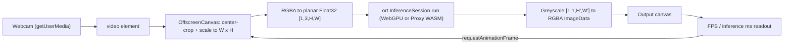

# Architecture: Webcam to Line Art (JavaScript)

This document describes the architecture of the `image-to-line-art-js` project, a fully client-side web application that turns a live webcam feed into line art using a machine learning model.

## 1. High-Level Overview

The application runs entirely in the browser. No server does any processing; a static file server only delivers the files. It uses **ONNX Runtime Web (ORT)** to run a pre-trained PyTorch model (converted to ONNX) locally. The app supports executing the model on the GPU (via WebGPU) for fast inference or on the CPU via WebAssembly (WASM). Webcam frames are captured, scaled to a chosen resolution, passed through the model, and drawn to a canvas in a continuous loop. An FPS counter shows how fast this runs.

Multi-threaded WASM is enabled with a Service Worker workaround, and CPU inference runs in a proxy Web Worker so the main thread stays responsive.

## 2. Repository Layout

| Path | Purpose |
| --- | --- |
| `index.html` | UI and all application logic (webcam capture, inference loop, pre/post-processing, FPS counter, backend and resolution selection) |
| `worker.js` | COOP/COEP Service Worker that enables cross-origin isolation (needed for WASM threads) |
| `model*.onnx` | Informative Drawings line-art generator models (various shapes, including standard `fp32` and WebGPU-optimized `fp16`), served locally |
| `js/libraries/ort/` | Vendored ONNX Runtime Web v1.30.0 (`ort.min.js` plus the `ort-wasm*.wasm` / `.mjs` backends) |
| `tools/` | Python scripts used to freeze model input shapes and generate `fp16` variants, as well as the original Colab notebook |
| `run.command` / `run.bat` | Convenience launchers that start `http-server` and open `http://127.0.0.1:8080` |

## 3. Core Components

### `index.html` (UI & Application Logic)
- **UI**: A dropdown to select the backend (Auto, WebGPU, WASM), a dropdown to select resolution (256x256, 320x240, 640x480, or custom dynamic shape), a start/stop button, a stats readout (FPS, inference time, resolution), and two side-by-side views: the live `<video>` and the line-art output `<canvas>`.
- **Backend Selection**: The page reloads with URL query parameters (`?backend=...&res=...`) when changing the backend or resolution, because ORT's environment cannot be safely changed after initialization.
- **ORT configuration**: sets `ort.env.wasm.numThreads` to `navigator.hardwareConcurrency` when the page is cross-origin isolated. For the WASM backend, it enables `ort.env.wasm.proxy` (inference runs in a background Web Worker).
- **Model initialization**: Automatically selects the best model for the current resolution and backend. If WebGPU is active, it loads the lighter `fp16` model variant. If the browser lacks WebGPU support, it safely falls back to WASM using the `fp32` model.
- **Webcam lifecycle**: `toggle()` requests the camera with `getUserMedia` (asking for 1280×720 if available) and starts `loop()`. `stop()` stops all media tracks and ends the loop.
- **Inference loop** (`loop()`): an `async` loop that processes one frame at a time and awaits each inference before starting the next.

### `worker.js` (COOP/COEP Service Worker)
Based on [`coi-serviceworker`](https://github.com/gzuidhof/coi-serviceworker). Intercepts every fetch and adds `Cross-Origin-Embedder-Policy: credentialless` and `Cross-Origin-Opener-Policy: same-origin` to the responses. This makes the page cross-origin isolated (`self.crossOriginIsolated === true`), which is required for `SharedArrayBuffer` (used by ORT for multi-threaded WASM).

### Machine Learning Models (`model*.onnx`)
The line-art generator from [Informative Drawings](https://github.com/carolineec/informative-drawings), converted to ONNX. It is fully convolutional.
- We provide **fixed-shape** optimized models (e.g., `model_320x240.onnx`, `model_640x480.onnx`, `model_256x256.onnx`) created by stripping dynamic dimensions and simplifying operations. Fixed shapes prevent massive WebGPU shader re-compilation stalls.
- Each fixed shape also has an `_fp16.onnx` variant optimized for WebGPU.
- The original dynamic `model.onnx` is retained as a fallback for the "Custom" resolution mode.

### ONNX Runtime Web (`js/libraries/ort/`)
A local copy of the ONNX Runtime Web library (`1.30.0`), allowing offline execution. It supports WebGPU execution directly on the main thread, or WebAssembly execution in the proxy worker.

## 4. Data Flow / Inference Pipeline

1. **Capture**: the `<video>` element plays the webcam `MediaStream`.
2. **Resolution**: The canvas scales the frame according to the currently selected dropdown value (e.g., 256x256).
3. **Pre-processing**: the frame is drawn onto a reusable `OffscreenCanvas`, center-cropped to the target aspect ratio, and scaled to W×H. The RGBA pixels are converted in one pass into a new planar `Float32Array` (R plane, then G, then B, alpha dropped, values divided by 255).
4. **Inference**: the array is wrapped in an `ort.Tensor` and passed to `onnxSession.run()`.
5. **Post-processing**: the greyscale output is scaled to 0–255 and copied into R, G and B (alpha 255) of a reused `ImageData`, which is drawn to the output canvas with `putImageData`.
6. **Stats**: frames are counted over windows of about 1 second.

## 5. Running Locally

Browsers only allow `getUserMedia` (webcam access) and Service Workers in a secure context, which means **localhost or HTTPS**. Opening `index.html` directly from disk (`file://`) won't work. Use `run.command` (macOS) or `run.bat` (Windows), which run `http-server` and open `http://127.0.0.1:8080`.

## 6. Key Web Technologies Used
* **WebGPU**: Modern GPU acceleration API for massive parallel processing of tensor operations.
* **MediaDevices.getUserMedia**: Webcam capture.
* **WebAssembly (SIMD + threads)**: Fast model execution on CPU.
* **Web Workers (ORT proxy mode)**: Keeps CPU inference off the main thread so the UI stays responsive.
* **Service Workers**: Add COOP/COEP headers on the client to get cross-origin isolation.
* **SharedArrayBuffer**: Lets the WASM threads share memory (needs cross-origin isolation).
* **OffscreenCanvas / Canvas 2D**: Frame scaling and cropping, pixel readback, and drawing the output.
