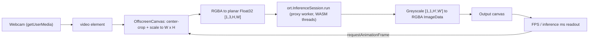

# Architecture: Webcam to Line Art (JavaScript)

This document describes the architecture of the `image-to-line-art-js` project, a fully client-side web application that turns a live webcam feed into line art using a machine learning model.

## 1. High-Level Overview

The application runs entirely in the browser. No server does any processing; a static file server only delivers the files. It uses **ONNX Runtime Web** to run a pre-trained PyTorch model (converted to ONNX) locally with WebAssembly (WASM). Webcam frames are captured, scaled to a resolution the user can edit, passed through the model, and drawn to a canvas in a continuous loop. An FPS counter shows how fast this runs.

Multi-threaded WASM is enabled with a Service Worker workaround, and inference runs in a proxy Web Worker so the main thread stays responsive.

## 2. Repository Layout

| Path | Purpose |
| --- | --- |
| `index.html` | UI and all application logic (webcam capture, inference loop, pre/post-processing, FPS counter) |
| `worker.js` | COOP/COEP Service Worker that enables cross-origin isolation (needed for WASM threads) |
| `model.onnx` | Informative Drawings line-art generator model (~17 MB), served locally |
| `js/libraries/ort/` | Vendored ONNX Runtime Web (`ort.js` plus the `ort-wasm*.wasm` / `.js` backends) |
| `tools/` | Colab notebook used to convert the original PyTorch model to ONNX |
| `run.command` / `run.bat` | Convenience launchers that start `http-server` and open `http://127.0.0.1:8080` |

## 3. Core Components

### `index.html` (UI & Application Logic)
- **UI**: width/height number inputs (default **320 × 240**), a start/stop button, a stats readout (FPS, last inference time, current resolution), a status line for errors, and two side-by-side views: the live `<video>` and the line-art output `<canvas>`. Both views are drawn at 640px wide, so small resolutions are scaled up for display.
- **ORT configuration**: sets `ort.env.wasm.numThreads` to `navigator.hardwareConcurrency` when the page is cross-origin isolated. It also enables `ort.env.wasm.proxy` (inference runs in a Web Worker) and sets an absolute `wasmPaths` so the proxy worker, which runs from a `blob:` URL, can find the WASM files.
- **Model initialization**: loads `model.onnx` into an `ort.InferenceSession` with the `wasm` execution provider as soon as the page opens. The start button stays disabled until loading finishes.
- **Webcam lifecycle**: `toggle()` requests the camera with `getUserMedia` (asking for 1280×720 if available) and starts `loop()`. `stop()` stops all media tracks and ends the loop.
- **Inference loop** (`loop()`): an `async` loop that processes one frame at a time and awaits each inference before starting the next, so frames never pile up. Between frames it yields with `requestAnimationFrame`, which also caps it at the display refresh rate.
- **Pre-processing** (`videoFrameToPlanarRGB`): see the data flow below.
- **Post-processing** (`drawGreyscaleToCanvas`): see the data flow below.

### `worker.js` (COOP/COEP Service Worker)
Based on [`coi-serviceworker`](https://github.com/gzuidhof/coi-serviceworker). The same file plays two roles:
- **On the page** (`window` defined): registers itself as a Service Worker and reloads the page once the worker is in control.
- **As the Service Worker**: intercepts every fetch and adds `Cross-Origin-Embedder-Policy: credentialless` and `Cross-Origin-Opener-Policy: same-origin` to the responses.

This makes the page cross-origin isolated (`self.crossOriginIsolated === true`). That is required for `SharedArrayBuffer`, which ONNX Runtime Web needs for multi-threaded WASM. Static hosts like GitHub Pages don't let you set these headers yourself, so this workaround fills the gap. Without isolation the app still works, but runs single-threaded.

### Machine Learning Model (`model.onnx`)
The line-art generator from [Informative Drawings](https://github.com/carolineec/informative-drawings), converted to ONNX (see `tools/`). It is fully convolutional, so it accepts different input sizes.
- **Input** `input`: `float32` tensor `[1, 3, H, W]`, planar RGB scaled to `[0, 1]`.
- **Output** `output`: `float32` tensor `[1, 1, H', W']`, greyscale in roughly `[0, 1]`. The output size is read from `out.dims` rather than assumed to equal the input size.

### ONNX Runtime Web (`js/libraries/ort/`)
A local copy of the ONNX Runtime Web library (no CDN), so the app works offline. At runtime ORT picks the best available WASM build (`simd`, `threaded`, or both) based on what the browser supports.

## 4. Data Flow / Inference Pipeline

1. **Capture**: the `<video>` element plays the webcam `MediaStream`.
2. **Resolution**: each frame, `getResolution()` reads the width/height inputs (rounded, minimum 16, falling back to 320×240 if invalid). Changes take effect on the next frame without restarting.
3. **Pre-processing**: the frame is drawn onto a reusable `OffscreenCanvas` (`willReadFrequently: true`), center-cropped to the target aspect ratio so the image isn't stretched, and scaled to W×H. The RGBA pixels are converted in one pass into a **new** planar `Float32Array` (R plane, then G, then B, alpha dropped, values divided by 255). A new buffer is created each frame because the proxy worker may take ownership of the one it receives.
4. **Inference**: the array is wrapped in an `ort.Tensor` and passed to `onnxSession.run()`. The time this takes is recorded.
5. **Post-processing**: the greyscale output is scaled to 0–255 and copied into R, G and B (alpha 255) of a reused `ImageData`, which is drawn to the output canvas with `putImageData`. The canvas is resized automatically if the output size changes.
6. **Stats**: frames are counted over windows of about 1 second, and the readout shows FPS, the last inference time in ms, and the current resolution.
7. **Errors**: if inference fails (for example, the model rejects a resolution), the error is shown in the status line and the loop waits 500 ms before trying again, so errors don't flood the page.

## 5. Running Locally

Browsers only allow `getUserMedia` (webcam access) and Service Workers in a secure context, which means **localhost or HTTPS**. Opening `index.html` directly from disk (`file://`) won't work. Use `run.command` (macOS) or `run.bat` (Windows), which run `http-server` and open `http://127.0.0.1:8080`.

## 6. Key Web Technologies Used
* **MediaDevices.getUserMedia**: webcam capture.
* **WebAssembly (SIMD + threads)**: fast model execution with ONNX Runtime Web.
* **Web Workers (ORT proxy mode)**: keeps inference off the main thread so the UI stays responsive.
* **Service Workers**: add COOP/COEP headers on the client to get cross-origin isolation.
* **SharedArrayBuffer**: lets the WASM threads share memory (needs cross-origin isolation).
* **OffscreenCanvas / Canvas 2D**: frame scaling and cropping, pixel readback, and drawing the output.
